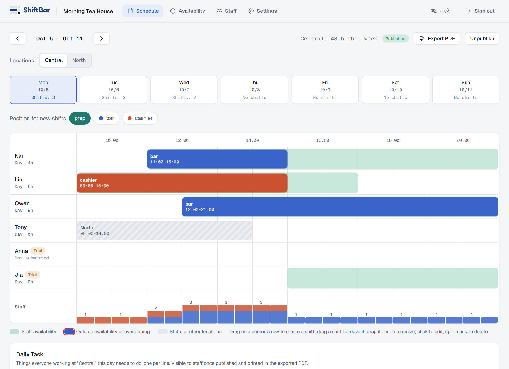
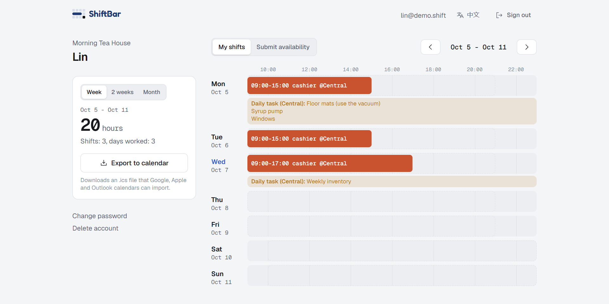
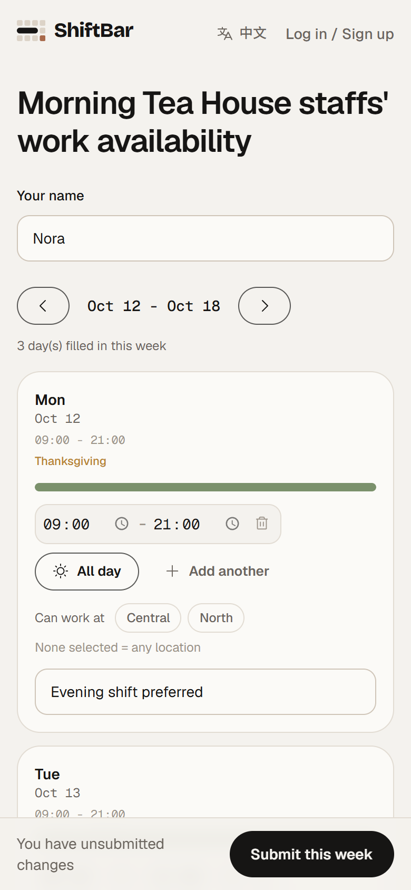
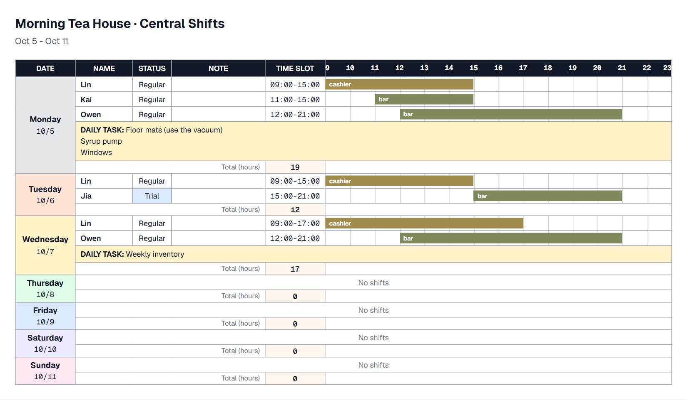
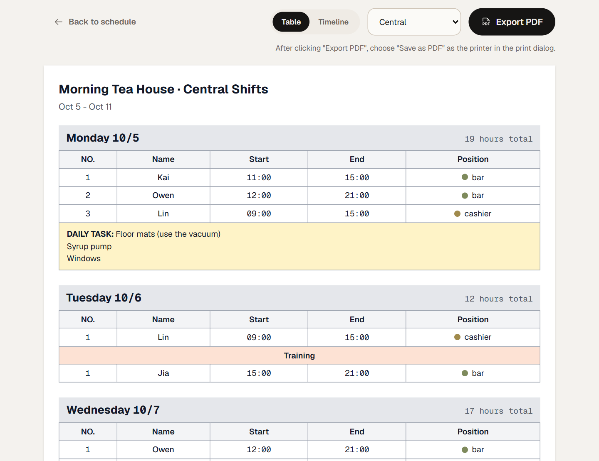

  <picture>
    <source media="(prefers-color-scheme: dark)" srcset="docs/assets/shiftbar-logo-dark.svg">
    
  </picture>

<h3 align="center">Shift scheduling for small shops</h3>

submit availability online · drag shifts onto a timeline · add the schedule to calendar

<a href="https://shift-scheduler-pi-ten.vercel.app/"><b>Open ShiftBar →</b></a>

<a href="README.md">中文</a> · English

  

## Who it is for

- Small shops that **build their schedule by hand**: tea and coffee shops, restaurants, retail.
- A manager who schedules many staff.
- Owners with **several locations sharing the same pool of staff**.
- Teams with a lot of turnover who need to tell **trial** staff from **regular** staff.

ShiftBar does one thing well: the first draft of the schedule. It does not do time clocks or payroll, and it will not schedule people for you. You decide who works when. It keeps everything visible, makes planning fast, and warns you about mistakes.

## How it works:

1. **The manager creates the shop** and sends staff the availability link (group chat, text message, anything).
2. **Staff open the link and enter when they can work.** No account needed, just a name.
3. **The manager sees everyone's availability on the timeline, drags shifts into place, and publishes.** Staff sign in to see their shifts and can add them to their phone calendar.

## Features

### For managers

- **Everyone on one screen**: one row per person, with their availability as translucent green underneath. Drag on a row to create a shift; drag the shift to move it, drag its ends to resize, click to edit, right-click to delete (with undo).
- **Automatic warnings**: a shift outside someone's availability, two overlapping shifts for the same person, or the same person booked at two locations at once all get a red outline.
- **Coverage at a glance**: the bottom of the timeline shows how many people are on, per position and per time slot, so thin or crowded spots stand out.
- **Define your own positions**: name and color are up to you. A tea shop might use prep / bar / cashier, a restaurant kitchen / front / host.
- **Several locations, one team**: schedule each location separately; staff say which locations they can work at. Shifts at your other locations show as grey stripes so nobody is booked in two places at once.
- **Open past midnight**: shifts can cross midnight, for example 17:45 to 01:00 the next day.
- **Daily tasks**: write down what everyone working that day needs to do (stock count, clean the windows, turn off the ice machine). Staff see it, and it prints on the exported schedule.
- **Trial and regular staff**: trial staff are tagged, and in the table-style export they get their own group.
- **Publish by week**: staff only see a week once you publish it, and you can unpublish if you need to fix something.
- **Export to PDF**: choose a "table" or "timeline" style, for one location or all of them. Print it for the wall or send it to the group.
- **Canadian statutory holiday reminders**: pick your province and holidays are flagged in the schedule, the availability form and the exported PDF.

### For staff

- **No account needed to submit availability**: open the link, enter your name, pick the times you can work. Choose "All day" or specific time ranges, and add a note ("class in the afternoon, evening shift preferred"). Come back and edit any time.
- **With several locations, choose where you can work**: choosing none means any location.
- **Sign up to see your schedule**: link your account with the shop code from your manager and your name, and you see your published shifts plus how many hours you have worked this week, two weeks or month.
- **Add shifts to your calendar in one click**: export an `.ics` file that Google, Apple and Outlook calendars can import.
- **Works on your phone**: the availability page and your schedule are made for phone screens, with no sideways scrolling.

### For everyone

- Switch between English and 中文 with one click; it follows your browser language by default.
- Dark mode follows your system setting.

## See it

**A staff member's schedule**: this week's shifts, daily tasks, hours worked, and one-click calendar export.

  

**Submitting availability (phone)**: no account, just a name and your times. With several locations you choose where you can work, and statutory holidays are flagged.

  

**The exported PDF schedule** comes in two styles. The **timeline style** shows each person's hours for the day as colored bars, with a total per day:

  

The **table style** lists number, name, start and end time and position, with trial staff grouped separately. Good for the wall:

  

## User guide

### Managers: first time

1. Open [ShiftBar](https://shift-scheduler-pi-ten.vercel.app/) and **sign up** (choose "Manager"), then **create your shop**. Give it a name and pick a position preset (tea / coffee shop, restaurant, retail), or choose "I'll define my own".
2. Go to **Settings > Shop**:
   - set the **opening hours** for each day (tick "Closed" for days off; if you stay open past midnight, just enter the closing time as `01:00` and it is read as the next day);
   - adjust your **position tags**;
   - add more **locations** if you have them;
   - copy the **staff availability link** and send it to your staff.
3. Once staff have submitted, the **Availability** page shows when each person is free, and who has not submitted yet.
4. Go to **Schedule**: pick a day, pick the "Position for new shifts", and **drag** on a person's row to create a shift. Click a shift to change its position, time or note; right-click to delete. Add a **daily task** below if you need one.
5. When it looks right, click **Publish this week** so staff can see it. If you spot a problem, click "Unpublish", fix it, and publish again.
6. Click **Export PDF**, choose "Save as PDF" as the printer in the print window that opens, and print or share the file.

A red outline means the shift is outside the person's availability, overlaps another shift of theirs, or they are already booked at another location at that time. Open the shift to see which. A red outline is only a warning; it never stops you from saving.

### Staff: submit availability (no account)

1. Open the **availability link** your manager sent you.
2. Enter your **name** (the same name your manager uses for you; next time the page remembers what you entered).
3. For each day, tap "All day" or choose specific time ranges. You can add several ranges per day and a note. A day you leave empty means you cannot work.
4. Tap **Submit this week**. You can come back and edit any time, and use the arrows above the form to move to next week and submit ahead.

### Staff: see your schedule and add it to your calendar

1. Open [ShiftBar](https://shift-scheduler-pi-ten.vercel.app/) and **sign up** (choose "Staff").
2. Enter the **shop code** from your manager (the last part of the availability link after `/s/`; managers can also find it in Settings) and your name. **Use the same name you used when submitting availability** and what you submitted earlier is linked to your account automatically.
3. **My shifts** shows your published shifts, and the left side adds up your hours for the week, two weeks or month.
4. Click **Export to calendar** and import the downloaded `.ics` file into your phone or computer calendar.
