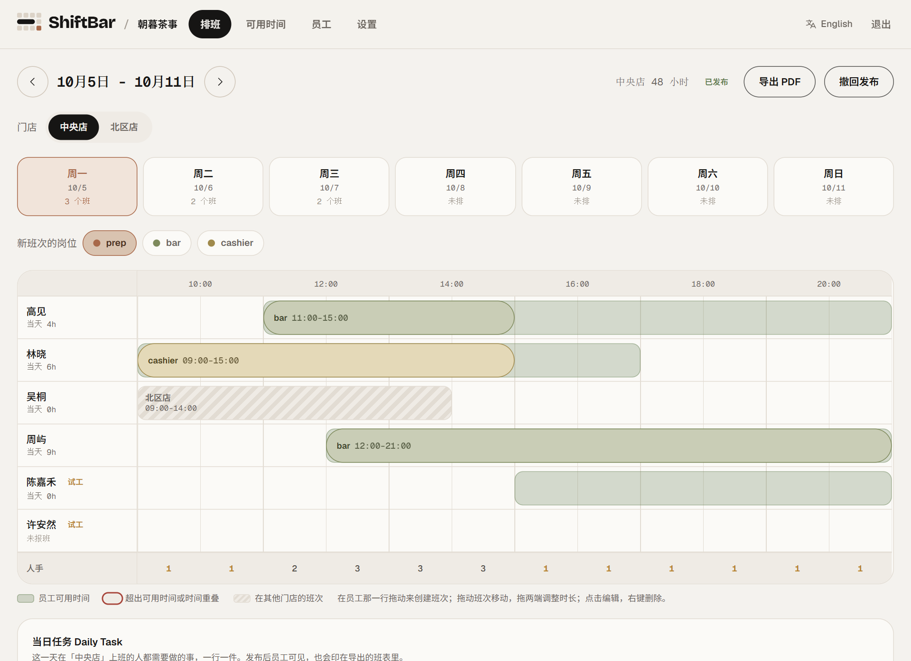
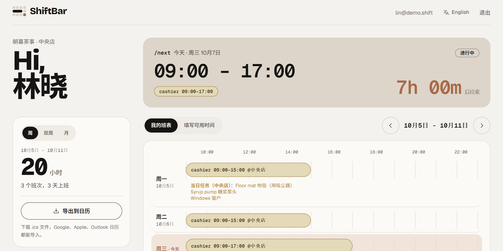
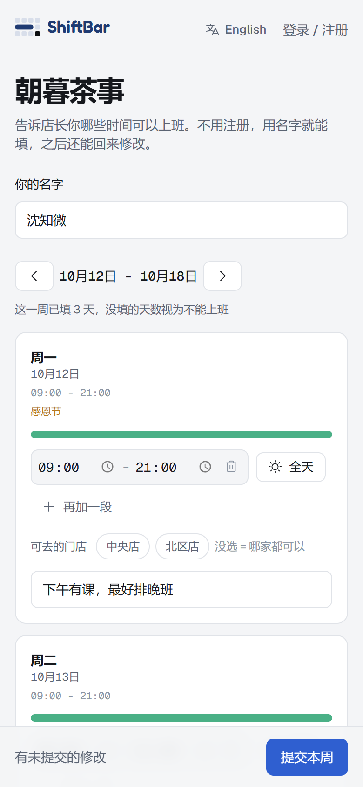
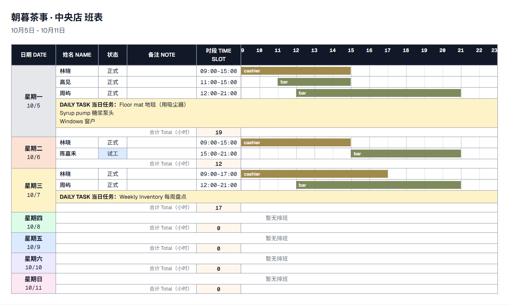
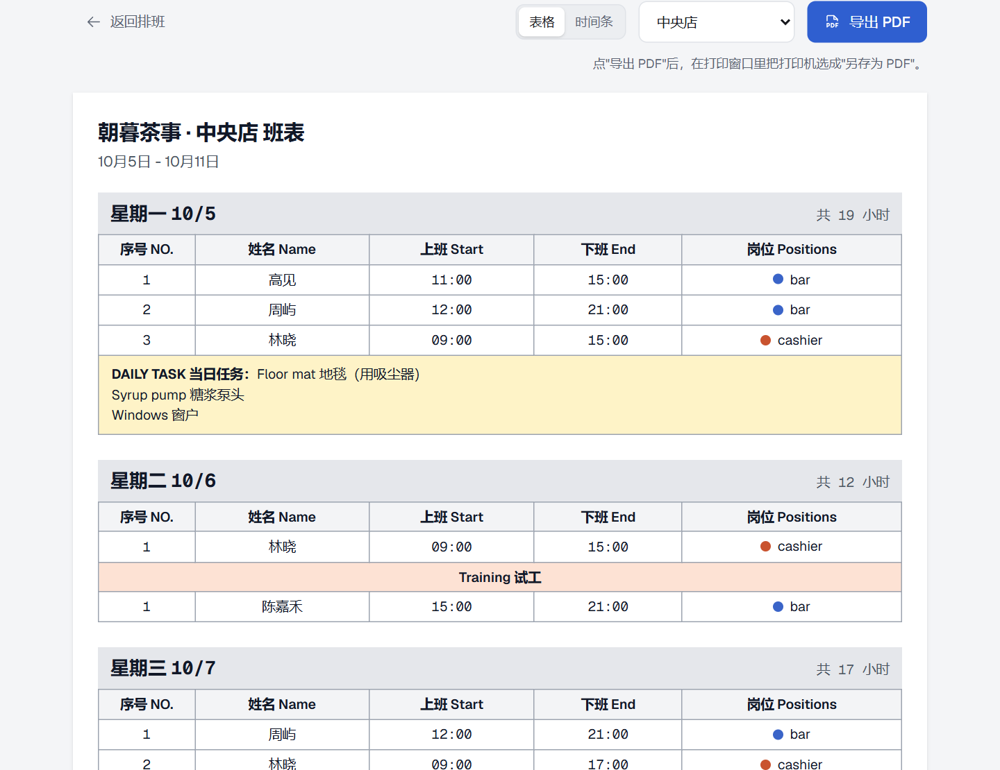

  <picture>
    <source media="(prefers-color-scheme: dark)" srcset="docs/assets/shiftbar-logo-dark.svg">
    
  </picture>

<h3 align="center">ShiftBar</h3>

员工在线报班 · 店长在时间轴上拖拽排班 · 发布后员工一键导入日历

中文 · <a href="README.en.md">English</a>

  

## 适合谁用

- 靠**手动排班**的小店：奶茶店、咖啡店、餐厅、零售店。
- 一个店长排班、员工很多的团队。
- 有**多家门店、共用同一批员工**的老板。
- 员工流动大，需要区分**试工**和**正式**员工。

ShiftBar 只专注于做辅助工具，更方便于手动排班和个人想法

## 怎么用：三步

1. **店长建店**，把"报班链接"发给员工（微信群、短信都行）。
2. **员工打开链接，填自己什么时候能上班**。不用注册，填名字就行。
3. **店长在时间轴上看着大家的空闲时间拖拽排班 → 发布**。员工登录后看到自己的班次，还能导入手机日历。

## 功能

### 店长

- **一屏看全**：每个员工一行，底层半透明的绿色是他们报的可用时间，直接在上面拖出班次。拖动可移动，拖两端可调整时长，点击可编辑，右键可删除（删错了有"撤销"）。
- **自动提醒**：排到员工没空的时间、同一个人的班次重叠、同一时间被排在两家门店，都会用红框标出来。
- **人手一目了然**：时间轴底部按岗位显示每个时段有几个人，一眼看出哪个时段人手太少或太多。
- **自己定义岗位**：名称和颜色都由你定，奶茶店可以是 prep / bar / cashier，餐厅可以是 kitchen / front / host。
- **多家门店共用一批员工**：按门店分别排班，员工报班时选自己能去哪几家；别家门店的班次会用灰色斜纹显示，避免一个人同时排在两处。
- **营业到半夜也没问题**：班次可以跨过午夜，例如 17:45 到次日 01:00。
- **当日任务**：每天可以写下上班的人要做的事（盘点、擦窗户、关制冰机……），员工和导出的班表里都会显示。
- **试工和正式**：试工员工会带标记；在导出的表格样式班表里，试工员工还会单独成组。
- **按周发布**：发布后员工才能看到那一周的班表，发错了可以撤回。
- **导出 PDF**：可以选"表格"或"时间条"样式，按门店或全部门店导出，打印张贴或发群里都方便。
- **法定假日提醒**：选择你所在的省份，遇到法定假日时在排班、报班和导出的班表里提醒。

### 员工

- **不用注册也能报班**：打开链接，填名字，选每天能上班的时间。可以选"全天"、多个时段，写备注。之后随时回来修改。
- **多门店时选自己能去的**：不选就表示哪家都可以。
- **注册后查看班表**：用店长给的店铺码和名字绑定账号，就能看到已发布的班次，并按周 / 双周 / 月统计自己上了多少小时。
- **一键导入日历**：导出 `.ics` 文件，Google、Apple、Outlook 日历都能导入。
- **手机上也能用**：报班页面和我的班表页面都适配了手机屏幕。

### 通用

- 中文和 English 一键切换，默认跟随浏览器语言。
- 深色模式跟随系统设置。

## 看看长什么样

**员工的班表**：本周的班次、当日任务、一共上了多少小时，一键导出到日历。

  

**员工报班（手机）**：不用注册，填名字、选时间。多家门店时选自己能去哪几家，遇到法定假日会有提醒。

  

**导出的 PDF 班表**有两种样式。**时间条样式**用彩色横条显示每个人一天的上班时段，并统计每天的总工时：

  

**表格样式**列出序号、姓名、上下班时间和岗位，试工员工单独成组，适合打印张贴：

  

## 使用指南

### 店长：第一次使用

1. **注册**（身份选"店长"），然后**创建店铺**。起个名字，选一个岗位预设（奶茶 / 咖啡店、餐厅、零售店），或者选"我自己来定义"。
2. 进入**设置 > 店铺**：
   - 设置每天的**营业时间**（休息日勾选"休息"；营业到半夜的话，关门时间直接填 `01:00`，系统会当作次日）；
   - 调整**岗位标签**；
   - 有多家店的话，在**门店**里添加；
   - 复制**员工报班链接**，发给员工。
3. 员工报班后，在**可用时间**页能看到每个人每天什么时候有空，以及谁还没报。
4. 进入**排班**页：选一天 → 选"新班次的岗位" → 在员工那一行**拖动**出班次。点击班次可以改岗位、时间和备注，右键可以删除。需要的话，在下面写上**当日任务**。
5. 排好后点**发布本周**，员工就能看到了。发现问题可以点"撤回发布"，改完再发布。
6. 点**导出 PDF**，在弹出的打印窗口里把打印机选成"另存为 PDF"，得到的文件可以打印张贴或发到群里。

红色边框的意思：这个班次排到了员工没空的时间、和同一个人的另一个班次重叠、或者同一时间已在另一家门店排了班。点开班次能看到具体原因。红框只是提醒，不会阻止你保存。

### 员工：报班（不用注册）

1. 打开店长发给你的**报班链接**。
2. 填上你的**名字**（和排班表上的名字保持一致，下次回来会自动带出你上次填的内容）。
3. 选择每天能上班的时间：点"全天"，或者选具体时段；一天可以加多个时段，还能写备注。不选的那天就表示不能上班。
4. 点**提交本周**。可以随时回来修改，也可以用页面上方的箭头切换到下一周，提前报班。

### 员工：查看班表、导入日历

1. **注册**（身份选"员工"）。
2. 输入店长给你的**店铺码**（报班链接 `/s/` 后面的那一段，店长也能在"设置"里看到）和你的名字。**用你之前报班时用的同一个名字**，之前报的班会自动归到你的账号下。
3. 在**我的班表**里查看已发布的班次，左边会统计你这周 / 双周 / 这个月一共上了多少小时。
4. 点**导出到日历**，把下载的 `.ics` 文件导入手机或电脑的日历。

技术栈：React + TypeScript + Tailwind CSS（前端），[Supabase](https://supabase.com)（登录与数据库）。
